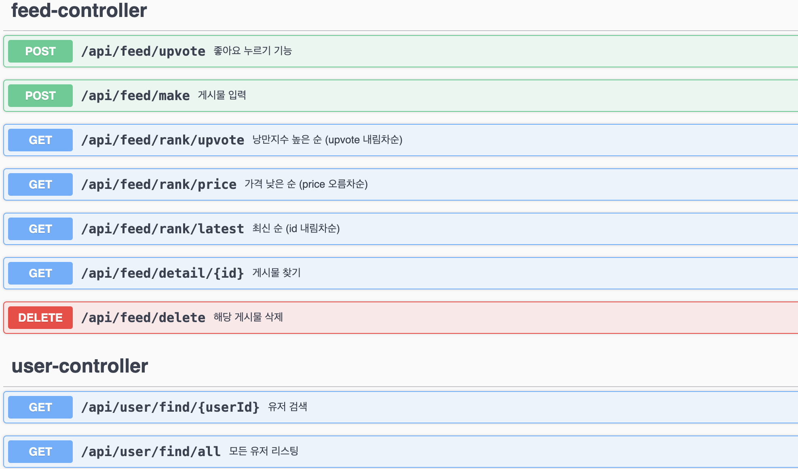

# Pard short heckerton, Team 도현이 또 늦었조

## 머ㄴ가 항상 저렴한 2ㅣ십대들의 서버
## 목차
- [소개](#소개)
- [시작하기](#시작하기)
    - [필수 조건](#필수-조건)
    - [설치](#설치)
- [API](#api)
- [License](#license)
- [Commit Message](#commit-message)

## 소개
> '청춘은 돈이 부족해도 낭만을 좇는것’ 이라는 정의를 실현할 수 있도록 낭만의 경험을 공유하는 동기부여 서비스

## 시작하기

### 필수 조건
- Java 17 이상
- MySQL 8.0 이상

### 설치

1. 저장소 클론
    ```bash
    git clone https://github.com/3rd-PARD-SERVER-PART/Meojeori.git
    ```   

2. Properties 설정

   - application-mysql.properties
   - application-oauth.properties
## API

## License


## Commit Message
By default, create a commit using the icon in https://gitmoji.dev/.

```
:sparkles: Add login pages
:bug: Fix CORS Error
```

🚀 - Deploy stuff `:rocket:`

⚡ - Improve performance `:zap:`

🔥 - Remove code or files `:fire:`

🐛 - Fix a bug `:bug:`

✨ - Introduce new features `:sparkles:`

✅ - Add, Update `:white_check_mark:`

📝 - Add or update documentation `:memo:`    

:see_no_evil: - Add or update ignore `:see_no_evil:`
